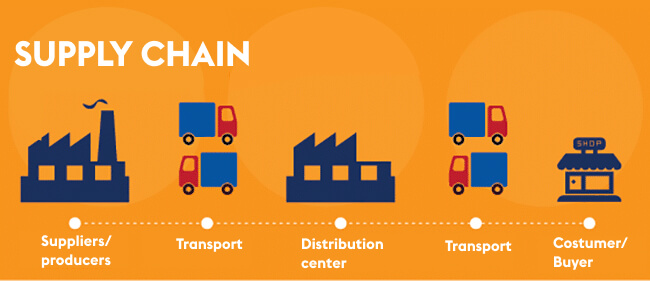

# Supply_Chain_Data_Science

## Overview

   

## Dataset

   

## ABC Analysis

   

ABC analysis is an inventory management technique that determines the value of inventory items based on their importance to the business. ABC ranks items on demand, cost and risk data, and inventory mangers group items into classes based on those criteria.

## Kraljic Matrix

   

The Kraljic matrix is a method for classifying and analysing the purchasing portfolio in order to guide the procurement strategy of companies. It is a tool for managing item categories for a company in relation to the market.

## Demand Segmentation

   

Syntetos et al categorizes the demand pattern for forecasting purpose into four smooth, erratic, intermittent and lumpy queries that are based on the cut-off value of p and v, where p is the average interdemandinterval(ADI) andvisthesquareof coefficient variation(CV2).Thecut-off valuefor p is 1.32 and
v is 0.49.

## EOQ

   

Economic order quantity (EOQ) is a calculation companies perform that represents their ideal order size, allowing them to meet demand without overspending. Inventory managers calculate EOQ to minimize holding costs and excess inventory.

